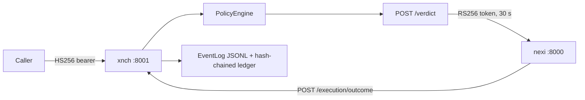

# xnch

**Control plane for the xNCH stack** — governance, memory, authorization, and audit for every action the system takes.

xnch is the REST service that decides what the xNCH AI system may do. It checks proposed actions against YAML policy rules, issues short-lived signed execution tokens, keeps memory in four tiers, writes an append-only audit trail, and tunes its own policies from outcomes. The nexi engine executes; xnch authorizes.

FastAPI app (`xnch.main:app`, v0.1.0). Listens on port 8001. Deployed on Node A (gate7) under systemd. Owns data, secrets, policies, and audit.

## Contents

- [Request lifecycle](#request-lifecycle)
- [API map](#api-map)
- [Memory tiers](#memory-tiers)
- [Governance and security](#governance-and-security)
- [Learning and consolidation](#learning-and-consolidation)
- [Layout](#layout)
- [Configuration](#configuration)
- [Tests](#tests)
- [Deployment](#deployment)
- [Sources of truth](#sources-of-truth)

## Request lifecycle



Every decision passes the same gate: interpret intent, load context, generate options, filter through `PolicyEngine`, emit an authoritative verdict, sign a token, record the outcome.

## API map

| Router | Prefix | Endpoint groups |
|---|---|---|
| session | `/session` | `/init`, `/clarify` |
| memory | `/memory` | `/read`, `/write`; `/graph/stats`, `/entities`, `/relations`, `/subgraph`, `/stream` (SSE); `tiers`/`all` designed, not routed |
| policy | `/policy` | `/check` (GET + POST), first-match-wins YAML rules |
| verdict | `/verdict` | Authoritative ALLOW/BLOCK; signs RS256 execution token |
| execution | `/execution` | `/execute`, `/outcome` |
| governance | `/governance` | `/weights` (+`/propose`, `/approve`), `/actors`, `/policy-candidates` |
| pipeline | `/governance/pipeline` | `/invoke`, `/resume`, `/{thread_id}` (optional LangGraph HITL) |
| auth | `/auth` | `/public-key` |
| nexi_gateway | `/nexi` | `/chat`, `/chat/stream`, `/system-prompt`, `/capabilities`, `/tools`, `/memory/recall`, `/memory/surface` |
| chat | `/v1/chat/completions` | OpenAI-compatible relay via LiteLLM |
| admin | `/admin` | `/consolidate`, `/reseed-identity` |
| voice | `/nexi/voice` | `/transcribe`, `/speak`, `/speak/upload`, `/chat` |
| goals | `/goals` | CRUD, `/claim` (lease), `/update`, `/step-outcome`, `/cancel` |
| workflows | `/workflows` | CRUD, `/run`, `/runs`, `/steps/claim`, `/steps/{id}/outcome` — writes gated |
| approvals | `/approvals` | List, get, decide (with `Idempotency-Key`) |
| mcp | `/mcp` | GET `/tools`, `/tools/openai`, `/servers`; POST `/call`, `/call/batch` |
| app-level | `/` | `/health`, `/system/state`, `/system/llm-status` |

## Memory tiers

| Tier | Store | Backend | Scope |
|---|---|---|---|
| L0 | Sensory buffer | Redis | Perception signals, ~60 s TTL |
| L1 | Working memory | Redis | Last 20 turns across 20 sessions |
| L2 | Episodic | Postgres + pgvector | MiniLM 384-d embeddings; cap 200 episodes / 30-day window; decay, importance, recall counts; keyed by `session_id` |
| L3 | Semantic graph | Kuzu (`~/.xnch/graph.kuzu`) + Postgres relationship mirror | Entities and relations, fed by triple extraction |

Supporting stores: pattern, quarantine, experience (SQLite/Postgres), goals and workflows (SQLite, atomic lease-based claims), KV cache (Redis), SSE graph broadcaster. `tier_graph.py` flattens all four tiers into one node/edge model; its `/memory/graph/tiers` and `/memory/graph/all` endpoints are designed (module docstring) but not yet wired to routes.

A second, curated memory ("agentmemory") runs in parallel outside xnch. xnch never writes to it implicitly — only explicit `am_*` tools touch it. Prefetch is off by default (`XNCH_AM_PREFETCH_ENABLED`); routing rules live at `~/.xnch/memory-routing.yaml`.

## Governance and security

- **Verdict authority.** `POST /verdict` returns ALLOW or BLOCK and signs an RS256 execution token: 2048-bit keypair under `~/.xnch/keys`, 30 s TTL (`XNCH_TOKEN_TTL_MS`), `jti` replay protection. Inbound callers authenticate with HS256 shared-secret bearers (`XNCH_AUTH_SECRET`).
- **Actor trust.** The `X-Actor-Role` header maps to five trust levels: `nexi`=SYSTEM; `operator`, `admin`=OWNER; `agent`, `opencode`, `perception_daemon`, `consolidation_job`=TRUSTED_AGENT; `viewer`=EXTERNAL_AGENT; `external`=UNTRUSTED. Requests below a route's minimum level get 403. See `security/trust_model.py`.
- **Input and write guards.** `injection_guard.scan_input` screens inbound text. `validate_memory_write` gates memory writes against caller capabilities.
- **Gateway token (Hybrid-B).** The web proxy mints `<expiry_epoch>.<hex(HMAC-SHA256(secret, expiry))>` tokens: 300 s TTL, constant-time verification, or a shared service key. Writes under `/workflows/*` and `/approvals/*` require one. An empty `XNCH_GATEWAY_SECRET` leaves the gate open — dev and test only.
- **HITL pipeline.** With `XNCH_LANGGRAPH_PIPELINE=true`, decisions run through a LangGraph graph with human-in-the-loop interrupts (`hitl_execution_mode=always`, risk threshold 0.5). Interrupted threads resume via `/governance/pipeline/resume`.

## Learning and consolidation

Three loops improve policy over time:

1. **Pattern extraction.** `PatternExtractor` mines decision episodes (minimum 10 observations, `XNCH_PATTERN_MIN_OBSERVATIONS`).
2. **Adaptation.** `ScoreAdapter` accepts adapters at 0.6 accuracy or better; `WeightEvolver` and `PolicyRuleEvolver` adjust weights and rules. The in-process APScheduler runs these every 6 hours.
3. **Candidates.** `PolicyCandidateGenerator` surfaces rule changes for human approval through `/governance/policy-candidates`.

The daily consolidation pass (a systemd timer POSTs `/admin/consolidate`) converts episodes into graph triples, upserts Kuzu and relationship stores, applies decay scores, and archives episodes below 0.1.

## Layout

```
xnch/
├── main.py              # FastAPI app + lifespan wiring
├── config.py            # pydantic-settings, XNCH_ prefix
├── routes/              # Routers (see API map)
├── models/              # Pydantic request/response models
├── auth/                # Keypair, token signer/verifier, governance store
├── security/            # Trust model, guards, gateway token
├── memory/              # L0-L3 stores, goal/workflow stores, tier graph
├── policy/              # YAML loader + first-match-wins engine
├── learning/            # Patterns, score adapter, candidates, evolvers
├── agents/              # Optional LangGraph pipeline + HITL runtime
├── routing/             # Local 'ornith' vs judgment-model classifier
├── audit/               # EventLog JSONL + SHA-256 ledger chain
├── jobs/                # Consolidation pass, workflow scheduling
├── perception/          # Library only — no HTTP entrypoint
├── voice/               # faster-whisper STT + piper TTS
├── observability/       # Langfuse client (empty keys = disabled)
├── policies/            # Bundled default.yaml, synced to ~/.xnch/policies
├── skills/              # Functional prompt assets
├── agents/vibe-dj/      # Persona prompt asset
├── litellm_config.yaml  # LiteLLM routing source for Node A
└── tests/
```

`perception/` provides classes only (VisionEncoder, VoiceDaemon, FileWatcher, AttentionFilter). There is no HTTP entrypoint for it.

## Configuration

All settings use the `XNCH_` prefix (pydantic-settings, `config.py`). Grouped highlights:

- **Paths.** Base dir `~/.xnch` plus derived dirs: `keys/`, `audit/`, `governance/`, `policies/`, `weights/`, `xnch.db`.
- **Services.** `XNCH_REDIS_URL`, `XNCH_POSTGRES_URL`, `XNCH_NEXI_BASE_URL`, `XNCH_SELF_BASE_URL`.
  Set a real Postgres DSN through the environment. The in-source default embeds credentials — a known hygiene bug. Never copy it into configs.
- **Auth and sessions.** `XNCH_AUTH_SECRET`, `XNCH_TOKEN_TTL_MS` (30000), session TTL, rate limit per minute.
- **Learning.** Pattern minimum observations (10), score adapter accuracy threshold (0.6).
- **Observability.** Langfuse key trio (empty disables), `XNCH_LITELLM_PROXY_URL`, LLM status probe (URL, `ornith-1.0-35b`, 3 s timeout).
- **Graph extraction.** `ornith` via LiteLLM by default; `llama_cpp/<model-file>` opts into the in-process backend.
- **Tool backends.** Seven `fs_*` fields (read-only filesystem), four `exec_*` fields (command execution), MCP bridge (enabled, servers path `~/.xnch/mcp-servers.yaml`, tool-round caps 3 / 5-with-bridge), web search policy plus SearXNG URL.
- **Memory routing.** Policy path, `am_prefetch_enabled` (false).
- **Pipeline and HITL.** `langgraph_pipeline` (false), `hitl_execution_mode` (always), `hitl_risk_threshold` (0.5).
- **Gateway and workflows.** `gateway_secret` (empty = open gate), `workflow_executor_enabled` (false keeps approve-DONE semantics; true leaves steps APPROVED for nexi to claim), claim lease 120 s.
- **Voice.** About 12 fields: whisper model/device/compute, piper voice paths, caps (60 s audio, 10 MiB, 2000 chars), models dir `~/.xnch/voice`.
- **Scraper.** Nested `ScraperSettings` with its own `SCRAPER_` prefix: tier auto, concurrency 5, timeout 30 s, social credentials.

The exhaustive variable reference lives at `../docs/reference/env-vars.md`. Separate repository — resolve that path from the parent checkout.

## Tests

From the parent repo root:

```bash
pytest xnch/tests        # package tests
pytest --cov=xnch        # coverage
pytest -k "workflow"     # keyword filter
```

Store tests use fakeredis. Async mode is automatic (`asyncio_mode = "auto"`).

## Deployment

Production runs on Node A (gate7) as `xnch.service`: `uvicorn xnch.main:app --port 8001`, environment from `EnvironmentFile=~/.xnch/xnch.env`, ordered after `docker.service`. A daily systemd timer POSTs `/admin/consolidate`.

Local development, from the parent repo root:

```bash
redis-server &                      # required
uv run python -m xnch.main          # port 8001
```

Redis is required. Postgres is required for L2 memory paths. [UNVERIFIED] on fresh clones — submodule runtime dependencies (redis client, apscheduler, whisper, piper) must be installed first.

Operational warnings:

- The Node A `perception.service` and `vault-indexer.service` units are intentionally parked and broken. Do not enable them. The perception package is a library with no server.
- Clients send their expected `system_state_version` at `/session/init`. A mismatch returns 409 until versions align.

## Sources of truth

Code wins over this README. Verify against:

- `xnch/main.py` — routers, lifespan wiring, app-level endpoints
- `xnch/config.py` — every setting and default
- `xnch/routes/` — exact endpoint contracts
- `xnch/security/trust_model.py`, `gateway_token.py`, `injection_guard.py`, `memory_guard.py`
- `xnch/memory/` — store behavior, `tier_graph.py` for the unified graph
- `xnch/policy/engine.py`, `xnch/learning/`, `xnch/jobs/consolidation.py`
- `xnch/auth/token.py`, `xnch/audit/ledger.py`
